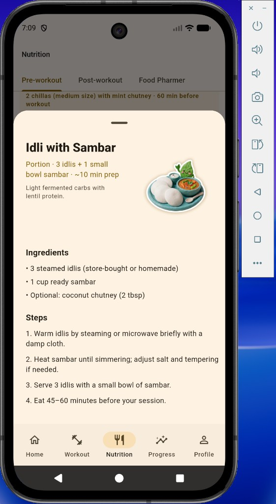

# The Muscle Builder

**Mood-aware workouts. Indian-diet fuel. Progress you can see.**

A Flutter companion that adapts today’s training to how you feel, pairs every session with practical Indian pre/post meals, and keeps your goals, routine, and history in one place.

<p align="center">
  
</p>

<p align="center"><em>Pre-workout fuel with clear portions, ingredients, and steps — built for real kitchens, not generic meal plans.</em></p>

---

## Goal

Help people train **consistently** and eat **on purpose** — especially when energy, mood, and Indian meal habits don’t match cookie-cutter Western fitness apps.

The Muscle Builder aims to make the daily loop obvious:

1. Check in with how you feel  
2. Get a session that fits  
3. Know what to eat before and after  
4. Log progress and stay honest with your “why”

---

## Problem

Most fitness apps fail people in the same places:

| Pain | What goes wrong |
| --- | --- |
| **One-size routines** | Plans ignore tired days, sore muscles, or limited equipment. |
| **Nutrition is abstract** | Macros without meals — or meals that don’t match Indian kitchens. |
| **Timing is unclear** | Users don’t know *what* to eat *when* relative to the gym. |
| **Motivation fades** | Goals live in a quiz once, then disappear from the product. |
| **Progress is fragmented** | Workouts, meals, weight, and rest days live in different apps. |

Result: people skip sessions, guess at food, and lose the story of why they started.

---

## Solution

The Muscle Builder closes that gap with a **local-first** loop designed for Indian users:

### Daily adaptive training
- Mood / energy check-in shapes intensity and focus  
- Muscle targets + equipment awareness  
- Session logging with rest cues and optional water breaks  

### Nutrition that feels familiar
- **Pre-workout** and **post-workout** meal libraries rooted in Indian food  
- Portions, prep time, ingredients, and step-by-step recipes  
- Diet filters (veg / non-veg / allergies) and unlockable recipe detail  
- Illustrated meal cards so fuel is memorable, not a wall of text  

### Progress & accountability
- Day history (gym / rest / cheat / skip), sessions, and meal history  
- Charts for adherence and body metrics (e.g. water, weight)  
- Weekly gym–rest–cheat template you control  

### A profile with a real “why”
- Primary goal, aspiration, and personal motivation  
- Settings for theme, coach tone, diet, equipment, and JSON backup  

---

## What’s inside

| Area | Highlights |
| --- | --- |
| **Home** | Today’s plan, hydration, quick entry points |
| **Workout** | Check-in → generated plan → live session logging |
| **Nutrition** | Pre / Post / Food Pharmer guides |
| **Progress** | History, charts, day detail |
| **Profile** | **You** (goals & story) · **Settings** (routine, prefs, backup) |

**Stack:** Flutter · Riverpod · Drift (SQLite) · go_router · fl_chart  

---

## Run locally

```bash
flutter pub get
flutter run
```

Requires a recent Flutter SDK (see `pubspec.yaml` / `environment.sdk`).

---

## License

MIT — see [LICENSE](LICENSE).

---

<p align="center">
  Designed & built by <strong>Akhansha Sen</strong>
</p>
