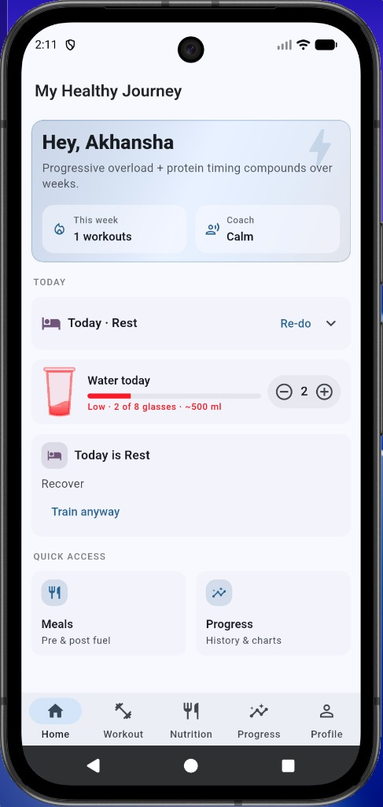
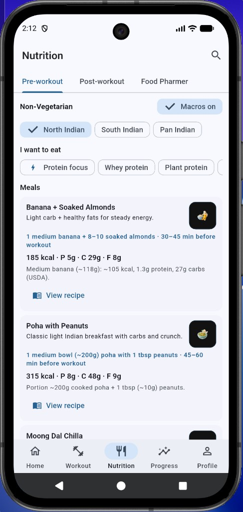
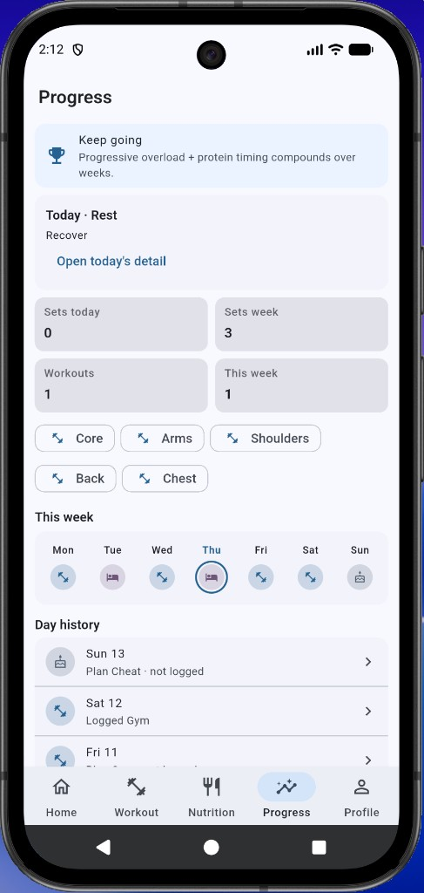

# 💪 The Muscle Builder

> **Mood-aware workouts. Indian-diet fuel. Progress you can actually see.**

A Flutter fitness companion that adapts every training session to how you feel, pairs it with real Indian pre/post-workout meals, and tracks your journey in one clean app — no subscriptions, no bloat.

---

## 📱 Screenshots

<p align="center">
  
  &nbsp;&nbsp;&nbsp;
  
  &nbsp;&nbsp;&nbsp;
  
</p>

<p align="center">
  <em>Home &nbsp;·&nbsp; Nutrition &nbsp;·&nbsp; Progress</em>
</p>

---

## ✨ What makes it different

Most fitness apps give you a fixed plan written for a 22-year-old gym bro in California. **The Muscle Builder** was built for real people — with real moods, real sore muscles, and real Indian kitchens.

| 🤔 The old way | ✅ The Muscle Builder way |
|---|---|
| Rigid plans you skip when tired | Check-in daily → plan adapts to your energy |
| "Eat 30g protein" — but how? | Actual Indian meals: Poha, Moong Dal Chilla, Banana + Almonds |
| No idea which muscles to rest | Hard recovery blocks when a muscle group is < 24 h from last session |
| Numbers without context | Logical exercise order: Opener → Primary → Volume → Finisher |
| Progress lives in 3 different apps | Gym log, water, meals, and history all in one place |

---

## 🚀 Core features

### 🏠 Home — your daily command centre
- Personalised greeting with your active goal and coach tone
- **Water tracker** with a live glass fill animation — never skip hydration again
- Today's day-type (Gym / Rest / Cheat / Skip) with one-tap re-do
- Quick links to Meals and Progress

### 🏋️ Workout — science-backed session planning
- **Mood & energy check-in** shapes which muscles to target and how hard to push
- Muscle recovery engine: hard 24 h block on any group trained yesterday — no overtraining
- Cap of **4 muscle groups per session** — real, manageable workouts
- Exercises ordered the way a real trainer would programme them:
  1. **Opener** — compounds & activation while you're fresh
  2. **Primary** — main strength work
  3. **Volume** — hypertrophy sets
  4. **Accessory** — targeted isolation
  5. **Finisher** — pump & burnout last
- Every exercise tagged with the muscle groups it hits

### 🥗 Nutrition — fuel for Indian kitchens
- **Pre-workout** and **post-workout** meal libraries with real Indian food
- Diet filters: Vegetarian / Non-Vegetarian · North / South / Pan Indian
- Goal filters: Protein focus · Whey · Plant protein
- Full recipe view with portions, timing ("45–60 min before workout"), macros, and USDA-backed calorie counts
- **Food Pharmer** tab: ingredient truth labels, no greenwashing

### 📈 Progress — stay honest with yourself
- Weekly calendar showing Gym / Rest / Cheat / Skip at a glance
- Muscle groups trained this week — with recovery-aware colour coding
- Set & workout counts for today and the week
- Full day history with drill-down detail per session

### 👤 Profile — your "why" front and centre
- Primary goal, personal aspiration, and motivation statement
- Coach personality, diet preferences, equipment setup
- Theme & appearance · JSON backup & restore

---

## 🛠️ Stack

| Layer | Tech |
|---|---|
| UI | Flutter |
| State | Riverpod |
| Local DB | Drift (SQLite) |
| Routing | go_router |
| Charts | fl_chart |

---

## ⚡ Run locally

```bash
flutter pub get
flutter run
```

Requires a recent Flutter SDK (see `pubspec.yaml` for the minimum SDK version).

---

## 📦 Install a build from GitHub

Every push to `main` runs [`.github/workflows/mobile-builds.yml`](.github/workflows/mobile-builds.yml) and produces ready-to-install binaries:

| Platform | Artifact | Notes |
|---|---|---|
| **Android APK** | `.apk` | Download → enable "Install unknown apps" → open |
| **Android AAB** | `.aab` | Upload directly to Google Play Console |
| **iOS IPA** | `.ipa` | Requires Apple Developer signing (see below) |

**How to download:**
1. [Actions](https://github.com/AkhanshaSen/The-Muscle-Builder/actions) → **Mobile builds** → latest run → **Artifacts**
2. On `main`, files are also pinned to the [**Latest build**](https://github.com/AkhanshaSen/The-Muscle-Builder/releases/tag/latest) release

### Signed Android release (Play Store)

CI produces a debug-signed APK without secrets. For Play Store / production:

```bash
keytool -genkey -v -keystore upload-keystore.jks -keyalg RSA -keysize 2048 -validity 10000 -alias upload
base64 -i upload-keystore.jks | pbcopy
```

Add four repository secrets (**Settings → Secrets → Actions**):

| Secret | Value |
|---|---|
| `ANDROID_KEYSTORE_BASE64` | Base64 of `upload-keystore.jks` |
| `ANDROID_KEYSTORE_PASSWORD` | Keystore password |
| `ANDROID_KEY_PASSWORD` | Key password |
| `ANDROID_KEY_ALIAS` | `upload` (or your alias) |

### iOS on a real device

Apple requires a paid [Developer account](https://developer.apple.com/programs/) + certificates/provisioning profile added to GitHub secrets. Use the Android APK for testing until that is set up.

---

## 📄 License

MIT — see [LICENSE](LICENSE).

---

<p align="center">
  Designed & built by <strong>Akhansha Sen</strong><br/>
  <em>Because your fitness journey deserves an app that actually knows you.</em>
</p>
